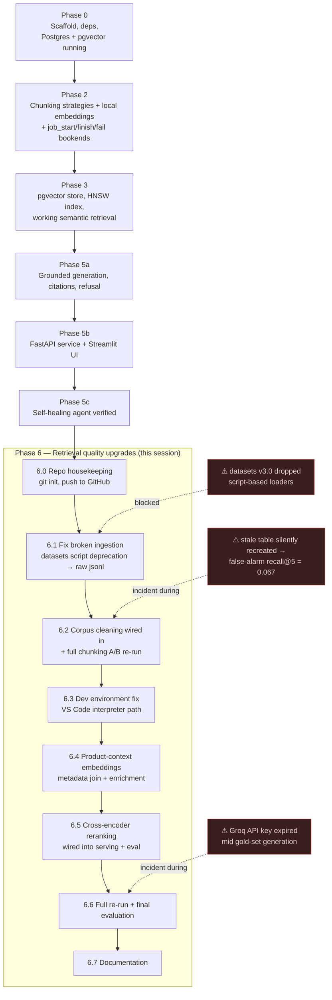

# Build Process: What Was Done, In What Order, and Why

This is the chronological build log — what happened, in what sequence, and the reasoning at each decision point. For the system organized by architectural layer instead of by time, see [`solution-design.md`](solution-design.md).

Phase numbers below match the project's own commit history. "Phase 6" and its subsections are the most recent working session and are documented in the most detail, since that work is fresh; earlier phases are summarized from their surviving code and the original project README.

---

## Timeline



---

## Phase 0 — Scaffold, dependencies, Postgres running

**What:** Repo scaffold (`src/` package layout by pipeline stage: `ingestion/`, `chunking/`, `embedding/`, `vectorstore/`, `generation/`, `eval/`, `api/`, `ui/`, `agent/`), `requirements.txt` pinned, and a local Postgres + pgvector container running via `docker run`.

**Why this shape, this early:** The package-per-stage layout was chosen before any stage had real logic in it, because the project's stated design commitment is "every pipeline stage is an observable, idempotent, restartable job" — that only works cleanly if each stage is a separately callable, separately testable unit from day one, rather than one script that happens to do everything in sequence.

**Why Postgres + pgvector specifically, decided this early:** Running the vector store locally in a container (rather than a managed vector DB) keeps the whole pipeline runnable offline/free during development, and — more importantly for the project's stated goals — lets metadata (rating, ASIN, category) live in the *same table* as the vectors. That means semantic search and SQL filtering (`WHERE rating >= 4`) compose in one query instead of needing a second system to join against.

---

## Phase 2 — Chunking strategies + local embeddings, made observable

**What:** `chunking/chunkers.py` implemented two chunking strategies (`fixed_size_chunks`, `sentence_chunks`) behind one `CHUNKERS` dict; `embedding/bge.py` wrapped `BAAI/bge-small-en-v1.5` (local, via `sentence-transformers`) behind an `EmbeddingClient` interface; `ingestion/jobs.py` added the `job_start` / `job_finish` / `job_fail` bookend pattern that every stage since has used.

**Why two chunking strategies instead of one:** The project's founding principle (see Phase 0) is "measured, not vibed" — rather than pick a chunk size by intuition, the codebase was built so both a naive approach (fixed character windows with overlap) and a linguistically-aware one (sentence-boundary-respecting) could be run through the *identical* downstream pipeline and compared on the *same* metric. This only works if chunking is a pluggable strategy from the start, not baked into the embedding step.

**Why local embeddings over an API:** `bge-small-en-v1.5` runs on a CPU in reasonable time (documented at ~32 min for the initial 67k chunks) and removes an external dependency, rate limit, and cost from the highest-volume step in the pipeline (every chunk gets embedded; only 150 questions get sent to an LLM in eval). API-based generation was still used downstream (Groq/Llama), but that step runs orders of magnitude fewer calls.

**Why `job_start`/`job_finish`/`job_fail` from this phase onward:** Once there are multiple pipeline stages that can each independently fail (HF outage, OOM during embedding, DB connection drop), "did it work?" stops being answerable by watching the terminal. Every stage since has opened with `job_start` and closed with either `job_finish` or `job_fail` — this is the substrate the later self-healing agent (Phase 5c) reads from; it didn't exist yet in Phase 2, but nothing about the agent would have been possible without this convention being established first.

---

## Phase 3 — pgvector store, HNSW index, working semantic retrieval

**What:** `vectorstore/pg.py` implemented `PgVectorStore` (a `VectorStore` interface) — table creation, upsert, cosine/inner-product ANN query, count — plus an HNSW index (`vector_ip_ops`) for fast approximate search over normalized vectors.

**Why HNSW over exact search:** At even moderate corpus size (tens of thousands of chunks), exact nearest-neighbor search over every row doesn't scale to interactive query latency. HNSW trades a small amount of recall for approximate search that stays fast as the table grows.

**Why inner-product ops specifically:** `bge-small`'s embeddings are L2-normalized at embedding time (`normalize_embeddings=True` in `embedding/bge.py`) — for normalized vectors, inner product and cosine similarity produce the same ranking, and inner product is cheaper to compute, so pgvector's `vector_ip_ops` operator class was used instead of `vector_cosine_ops`.

**Why upsert (`ON CONFLICT DO UPDATE`) instead of insert:** Combined with content-hash-derived IDs (chunk ID = hash of parent review text + sequence number), this makes every load idempotent — re-running a load after a partial failure doesn't create duplicate rows, it just overwrites the same ones. This is the same "safely re-runnable" property the job bookends were building toward.

---

## Phase 5a — Grounded generation with citations

**What:** `generation/rag.py` (`RagPipeline`) assembled retrieval + an LLM prompt into one `ask()` call: embed the question, fetch top-k chunks, format them as a numbered context block, and prompt Llama 3.1 (via Groq) with a system prompt that requires citing sources by number, presenting disagreement between reviews rather than picking a side, and explicitly refusing when the retrieved context doesn't answer the question.

**Why refusal is an explicit rule, not an afterthought:** A RAG system that always produces a confident-sounding answer regardless of whether the retrieved context actually supports it is worse than one that sometimes says "I don't know" — the former fails silently (a wrong answer that reads as authoritative), the latter fails loudly. The system prompt makes refusal a first-class behavior instead of hoping the model infers it.

**Why low temperature (0.2, not the initial 0.7):** For grounded Q&A, the goal is faithfulness to the provided context, not creative variation — a lower temperature makes the model more likely to stay close to what the retrieved excerpts actually say rather than embellishing.

---

## Phase 5b — FastAPI service, Streamlit UI

**What:** `api/main.py` wrapped `RagPipeline` in a FastAPI service (`GET /health`, `POST /ask`) with Pydantic request/response models; `ui/app.py` built a Streamlit chat interface that calls the API and renders answers with expandable, scored source citations.

**Why a thin API layer instead of calling `RagPipeline` directly from the UI:** Separating the two means the retrieval/generation logic has one HTTP contract that any client can use — the Streamlit UI is one consumer, but nothing about the design assumes it's the only one.

---

## Phase 5c — Self-healing agent verified

**What:** `agent/monitor.py`, `agent/diagnose.py`, `agent/registry.py`. The agent polls the `jobs` table (written by every stage since Phase 2) for `status='failed'` rows with no `healing_log` entry yet, sends the job name and error to an LLM (`diagnose.py`) that must respond with exactly one action from a fixed menu (`retry` / `retry_with_failover` / `escalate`), and — for `retry` — looks up a re-runnable function for that job from an explicit allowlist (`registry.py`) and retries it up to twice with linear backoff, logging every decision (diagnosis, action, outcome) to a `healing_log` table.

**Why the LLM's output is constrained to a fixed menu, not free text:** An agent that can take arbitrary action based on an LLM's free-form judgment of a stack trace is a genuine risk surface. Constraining the model to choose from `{retry, retry_with_failover, escalate}` and validating that the response is one of exactly those three (falling back to `escalate` if parsing fails, per `diagnose.py`) means the *diagnosis* can be flexible while the *action space* stays small and auditable.

**Why an explicit registry instead of "run whatever job failed again":** `registry.py`'s own docstring states the constraint plainly: *"The agent may ONLY invoke these."* A job name is just a string in the `jobs` table — without an allowlist, "retry this job" would mean dynamically resolving and calling arbitrary code from a database value, which is a code-execution risk. The registry maps known-safe, known-idempotent job-name prefixes to specific functions; anything not in it escalates instead of being guessed at.

**Why escalate-on-failure-to-parse, not retry-by-default:** `diagnose.py`'s fallback path is explicit: *"if the LLM misbehaves, fail SAFE: escalate, never guess an action."* Retrying blindly risks looping on a non-transient failure (e.g., a schema bug) forever; escalating a failure the system isn't confident about is the conservative default.

---

## Phase 6 — Retrieval quality upgrades (this session)

This phase started by resuming a project that had been dormant for a while, and moved through several distinct steps in order — each one surfaced the next.

### 6.0 — Repository housekeeping
Before any pipeline work: initialized a git repo at the workspace root (`vector-embedding-platform` had its own nested `.git` with one commit; that was removed and the repo re-initialized at the parent root so the whole workspace is one repo), authenticated `gh` under the correct account, and pushed to `origin/main`. Not a technical design decision, but a necessary precondition for everything after it to be tracked.

### 6.1 — Fixing a broken ingestion path
The first thing attempted after resuming was running the pipeline, which immediately failed:
```
RuntimeError: Dataset scripts are no longer supported, but found Amazon-Reviews-2023.py
```
**Diagnosis:** the `datasets` library (now at v5.0.0) dropped support for HuggingFace dataset repos that require a custom Python loading script — a change made *after* this project's ingestion code was originally written against an older `datasets` version. This is exactly the kind of environment drift the project's design anticipates (see the original README's observability rationale).

**Two options considered:** downgrade `datasets` to a version that still supports scripts, or route around the script entirely. Downgrading was rejected — `datasets<3.0` requires an older `huggingface_hub` than the one already pinned for newer `transformers`/`langchain` packages, so it would have traded one broken import for a dependency conflict. Instead, `ingestion/load.py` was pointed at the same dataset repo's plain `raw/review_categories/Electronics.jsonl` file (confirmed to exist via `HfApi.list_repo_files`) and loaded via the generic `"json"` loader, which needs no script and no `trust_remote_code`.

### 6.2 — Corpus cleaning, actually applied
While verifying the fix, sampling the corpus surfaced junk `clean_text()` wasn't catching: `[[ASIN:...]]` product-reference tags and undecoded HTML entities — and, on closer inspection, `clean_text()` wasn't being *called* at all before the length filter. See [`retrieval-quality-upgrades.md`](retrieval-quality-upgrades.md#1-corpus-cleaning-applied-where-it-actually-takes-effect) for the full detail; in process terms, the sequence was: extend the regex → decode entities → move the call to run before the hash/length filter → re-run ingestion → re-embed both chunking strategies → reload both Postgres tables → regenerate the gold set → re-evaluate. Every one of those re-runs was necessary because chunk/parent IDs are content-hash-derived from the cleaned text — cleaning the text changes the IDs, which invalidates every downstream artifact keyed on the old ones.

**A concrete incident from this step:** partway through, evaluating the freshly-regenerated gold set against the *old*, pre-cleaning `chunks` table returned recall@5 = 0.067 — a number low enough to look like a serious regression. It wasn't a retrieval regression: it was two artifacts from different corpus versions being compared as if they were the same, because `PgVectorStore.__init__` silently recreates a table via `CREATE TABLE IF NOT EXISTS` if it doesn't exist, so an eval run against a since-dropped table's name quietly produces an empty table and a near-zero score instead of an error. The stale table was dropped, and `retrieval_eval.py`'s default `tables` argument was updated to point at the current table names so this couldn't recur silently.

### 6.3 — Development environment fix
Separately, the API failed to start from the IDE's run button with `ModuleNotFoundError: No module named 'sentence_transformers'`, despite the module being installed in `.venv`. Diagnosis: the IDE run button was using a different Python interpreter than the project's virtualenv. Fixed via `.vscode/settings.json` (`python.defaultInterpreterPath` pointing at `.venv/bin/python`) rather than reinstalling anything — the dependency was never missing, the interpreter selection was wrong.

### 6.4 — Product-context embeddings
Requested explicitly: prepend product metadata to chunk text before embedding, on the hypothesis that a bi-encoder embedding review text alone has no signal about *what product* the review describes. Implementation and the schema-casting workaround it required are detailed in [`retrieval-quality-upgrades.md`](retrieval-quality-upgrades.md#2-product-context-embeddings). Process-wise, this required re-running ingestion (to join metadata), then re-embedding both strategies (enrichment happens at embed time), then reloading both tables — the same "cascade" as 6.2, because changing what gets embedded changes the vectors even though the underlying chunk IDs don't move this time.

### 6.5 — Cross-encoder reranking
Requested alongside 6.4, explicitly framed as "the biggest MRR gain." Implementation in [`retrieval-quality-upgrades.md`](retrieval-quality-upgrades.md#3-cross-encoder-reranking). Process note: this was wired into *both* the production RAG path (`generation/rag.py`) and the eval harness (`eval/retrieval_eval.py`) in the same step, deliberately, so the eval numbers that resulted from 6.6 below would reflect exactly what a real query would experience — not a version of retrieval that only exists in the test harness.

### 6.6 — Full re-run and final evaluation
With 6.4 and 6.5 both landed, the full chain was re-run once: ingest (metadata join) → embed both strategies (enriched) → load both tables → regenerate gold set → evaluate both with reranking on. One operational snag mid-run: the Groq API key had expired (`401 expired_api_key`) during gold-set generation; a new key was supplied and swapped into `.env`, and the run was restarted from that step. Final results and their honest interpretation (mixed recall, consistent MRR gain) are in [`retrieval-quality-upgrades.md`](retrieval-quality-upgrades.md#test-results).

### 6.7 — Documentation
This round of docs — separating the chronological account (this file) from the by-layer technical reference (`solution-design.md`), consolidating everything under `docs/`, and leaving a slim landing-page README at the repo root — was the closing step of this phase, done for the same reason the project journals its own eval-debugging story in the original README: a system that's hard to reconstruct the reasoning for is a system nobody can safely change later, including future sessions of this same work.

---

## Where things stand now

- Live and current: cleaned corpus, both chunking strategies re-embedded with product-context enrichment, both Postgres tables (`chunks_sentence`, `chunks_fixed`) loaded, cross-encoder reranking wired into both serving and eval paths, `embed:fixed`/`vecload:pg:chunks_fixed` registered in the self-healing agent's job registry.
- Not yet done: an ablation isolating enrichment's contribution from reranking's (see `retrieval-quality-upgrades.md`'s follow-ups).
