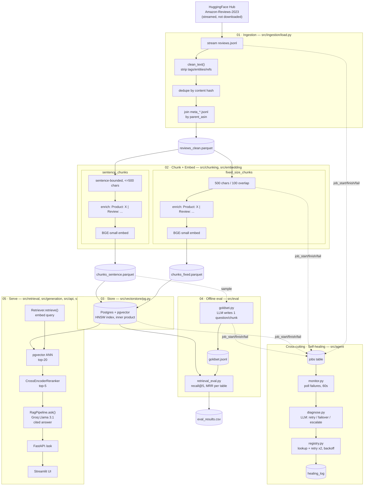

# Solution Design

This document explains the system by **architectural layer** — what technology is used at each stage, why it was chosen over the alternatives, and how it's implemented. For the chronological account of how the system got here, see [`process.md`](process.md).

---

## Design principles

Three commitments run through every layer below, stated once here rather than repeated at each stage:

1. **Vendor-agnostic seams.** Embeddings, vector storage, and text generation each sit behind a small abstract interface (`EmbeddingClient`, `VectorStore`, `LLMClient`). The current implementations are open-stack (bge-small / pgvector / Groq); swapping any one for a different backend means writing one new file, not touching the pipeline that calls it.
2. **Every stage is an observable, idempotent job.** Each pipeline stage calls `job_start` / `job_finish` / `job_fail` (writing to a Postgres `jobs` table) and is safe to re-run — IDs are content-hash-derived and loads are upserts. This is what makes automated retry (the self-healing agent) possible at all.
3. **Retrieval quality is measured, not assumed.** Every retrieval-affecting change (chunking strategy, cleaning, enrichment, reranking) is run through the same recall@k / MRR harness against an LLM-generated gold set before being treated as an improvement.

---

## Architecture diagram

---

## Stage-by-stage detail

### 1. Ingestion — `src/ingestion/load.py`, `src/ingestion/jobs.py`

| | |
|---|---|
| **Technology** | `datasets` (HF), `huggingface_hub.HfFileSystem`, `pandas`, streaming HTTP reads |
| **Source data** | [`McAuley-Lab/Amazon-Reviews-2023`](https://huggingface.co/datasets/McAuley-Lab/Amazon-Reviews-2023) — Electronics category reviews + companion product metadata |

**What it does:** Streams `raw/review_categories/Electronics.jsonl` record-by-record (never downloads the full dataset), cleans each review's text, filters by length and rating presence, dedupes by content hash, and joins product metadata (title, category) by `parent_asin`.

**Why streaming, not a bulk download:** The category file alone is large, and the pipeline only needs a bounded sample (`limit` parameter, default 50,000 raw records) — streaming lets the ingest stop as soon as it has enough, rather than pulling the whole file first.

**Why `"json"` loader instead of the dataset's own loading script:** The repo ships a canonical loader (`Amazon-Reviews-2023.py`) that newer `datasets` versions (v3.0+) refuse to execute (`trust_remote_code`-gated script loading was removed). The repo separately exposes the same data as plain `.jsonl` files under `raw/review_categories/`, which the generic `"json"` builder reads with no script and no remote-code execution — functionally equivalent data, without depending on a code path HF deprecated.

**Cleaning (`clean_text()`):**
- `html.unescape()` — decodes entities (`&#34;`, `&amp;`, `&#8211;`, ...) found by sampling the live corpus.
- `BRACKET_TAG_RE` — strips `[[VIDEOID:...]]` and `[[ASIN:...]]` markup (a single generalized pattern rather than one regex per tag type, since both share the `[[TYPE:...]]` shape).
- `TAG_RE` — strips HTML tags (` `, etc).
- Runs **before** both the length filter and `text_hash()` — see [`process.md` §6.2](process.md#62--corpus-cleaning-actually-applied) for why call order mattered here.

**Deduplication:** SHA-256 hash of the cleaned, lowercased, stripped text; first 16 hex characters become the review's `id` (and therefore every downstream chunk's `parent_id` prefix). Content-addressed IDs mean the *same* review text always produces the *same* ID — which is what makes re-running ingestion idempotent, and also what makes a corpus-version change (e.g. cleaning) produce a clean break rather than silent ID collisions with the old version.

**Product metadata join (`load_product_meta()`):** Reads `raw/meta_categories/meta_Electronics.jsonl` (~5.2 GB) by streaming raw lines via `HfFileSystem` and `json.loads` per line — **not** via `datasets.load_dataset`, which crashes on this specific file (`TypeError: Couldn't cast array of type struct<...> to null`) because the file has inconsistent per-record schema (an `author` field that's a struct in some records, null in others) that breaks Arrow-based schema inference partway through the stream. The line-by-line approach sidesteps Arrow entirely, and short-circuits once every needed `parent_asin` has been found rather than scanning the full file when possible.

**Every run writes to `jobs`:** `job_start(f"ingest:{category}")` → work → `job_finish(records_in, records_out)` or `job_fail(error)`. This is the hook the self-healing agent (§9) reads.

---

### 2. Chunking — `src/chunking/chunkers.py`

| | |
|---|---|
| **Technology** | Plain Python + `re` (no chunking library) |
| **Strategies** | `fixed_size_chunks`, `sentence_chunks`, selected via a `CHUNKERS` dict by string key |

**`fixed_size_chunks`:** Slides a fixed-width window (default 500 characters) over the text with overlap (default 100 characters), with no regard for word or sentence boundaries.

**`sentence_chunks`:** Splits on sentence-ending punctuation (`re.split(r"(?<=[.!?])\s+", text)`), then greedily packs whole sentences into chunks up to a character budget (default 500), never splitting a sentence across two chunks.

**Why both exist, side by side, behind one interface:** Rather than assume which strategy is better, the pipeline was built so either could flow through identical downstream steps (embedding, storage, eval) and be compared on the same metric. See §8 (Evaluation) for the actual comparison.

**Chunk IDs:** `f"{parent_id}-{seq}"` — deterministic from the parent review's content hash and the chunk's position, so re-chunking the same review always produces the same IDs.

---

### 3. Product-context embeddings — `src/embedding/`

| | |
|---|---|
| **Technology** | `sentence-transformers`, `BAAI/bge-small-en-v1.5` (384-dim, local inference) |

**Why a local bi-encoder over an embedding API:** No per-call cost or rate limit on the highest-volume step in the pipeline (every chunk gets embedded — tens of thousands of calls, versus a few hundred LLM calls elsewhere). `bge-small` is small enough to run acceptably on a laptop CPU.

**Why normalize embeddings:** `normalize_embeddings=True` in `BgeEmbeddingClient.embed()` — with unit-normalized vectors, cosine similarity and inner product produce identical rankings, which lets the vector store use the cheaper inner-product operator (see §4).

**Product-context enrichment:** Before embedding, each chunk's text is wrapped as `"Product: {title or category} | Review: {chunk text}"` — the *embedded* string, not the *stored* one. `embedding/run.py` keeps two parallel lists: `texts` (original, written to the `text` column for display/citation) and `embed_texts` (enriched, sent to the embedding model). Rationale: a review chunk in isolation carries no signal about which product it describes; prepending product identity gives the embedding model that context without polluting what a user or the LLM ultimately sees. The query side is deliberately **not** enriched (the system doesn't know the target product at ask-time — see [`retrieval-quality-upgrades.md`](retrieval-quality-upgrades.md#2-product-context-embeddings)).

**Fallback:** product title falls back to category (`"Electronics"`) when a chunk's `parent_asin` has no metadata match (~30% of chunks) — see `process.md` §6.4 and `retrieval-quality-upgrades.md` for the fill-rate number.

---

### 4. Vector storage — `src/vectorstore/pg.py`, `src/vectorstore/load.py`

| | |
|---|---|
| **Technology** | PostgreSQL + the `pgvector` extension, `psycopg2`, HNSW index |

**Why Postgres+pgvector over a dedicated vector database:** Metadata (rating, ASIN, parent ASIN, helpful votes) lives in the *same row* as the embedding, so a semantic search and a SQL filter (`WHERE rating >= 4`) compose into one query — no second system to keep in sync, no client-side join.

**Why HNSW, and why `vector_ip_ops`:** HNSW gives approximate nearest-neighbor search that stays fast as the table grows, trading a small amount of recall for speed versus exact search. The index is built on the inner-product operator class specifically because embeddings are pre-normalized (§3) — inner product ranks identically to cosine similarity on unit vectors and is cheaper to compute.

**Why one table per chunking strategy** (`chunks_sentence`, `chunks_fixed`) rather than one shared table with a strategy column: keeps the A/B genuinely isolated — evaluating "strategy X" is just pointing at "table X," with no risk of a query accidentally mixing both strategies' chunks in one result set.

**Idempotent loads:** `PgVectorStore.upsert()` issues `INSERT ... ON CONFLICT (id) DO UPDATE`, so re-running a load (e.g. after a partial failure, or after re-embedding the same corpus with a new enrichment scheme) overwrites existing rows in place rather than duplicating them.

**A caveat worth documenting:** `PgVectorStore.__init__` runs `CREATE TABLE IF NOT EXISTS` — convenient for first-run setup, but it means querying a table name that doesn't exist yet silently creates an *empty* one instead of erroring. This produced a real false-alarm incident (recall@5 = 0.067 against a stale, since-recreated-empty table) — see `process.md` §6.2. Worth keeping in mind if a table name is ever mistyped.

---

### 5. Retrieval — `src/retrieval/retriever.py`, `src/retrieval/reranker.py`

| | |
|---|---|
| **Technology** | pgvector ANN search (bi-encoder) + `sentence-transformers.CrossEncoder` (`cross-encoder/ms-marco-MiniLM-L-6-v2`) |

**Two-stage retrieval, not one:**
1. **Retrieve (cheap, broad):** embed the query with the same bi-encoder used for passages, pull the top 20 candidates from pgvector via ANN search.
2. **Rerank (expensive, narrow):** score all 20 `(query, passage)` pairs directly with a cross-encoder, keep the top 5.

**Why two stages instead of cross-encoder-only:** A cross-encoder can't be pre-indexed — every query would need to be scored against *every* passage in the corpus, which doesn't scale. Bi-encoder ANN search narrows tens of thousands of candidates to 20 cheaply; the cross-encoder only has to do its more expensive, more accurate scoring on that small set.

**Why a cross-encoder adds value the bi-encoder alone doesn't:** A bi-encoder embeds the query and each passage *independently* and compares vectors after the fact — it can never model interaction between specific query and passage tokens. A cross-encoder reads both together in one forward pass, which is a strictly richer relevance signal, at a cost that's now bounded (20 pairs, not the whole corpus) by stage 1.

**`Retriever` is the single code path for both consumers:** `generation/rag.py` (the live API) and `eval/retrieval_eval.py` (the offline harness) both call `Retriever.retrieve()` — deliberately, so the eval numbers measure exactly what a real query experiences rather than a parallel implementation that could drift from production behavior.

---

### 6. Generation — `src/generation/`

| | |
|---|---|
| **Technology** | Groq API, Llama 3.1 8B Instant, `groq` Python SDK |

**Why Groq/Llama specifically:** Fast inference (relevant for an interactive `/ask` endpoint) at effectively no cost for this project's volume, behind the `LLMClient` interface so a different provider is a one-file swap.

**Prompting design (`generation/rag.py`):** top-k retrieved chunks are formatted as a numbered context block; the system prompt requires the model to (1) refuse rather than guess when the context is insufficient, (2) cite sources by number after each claim, (3) surface disagreement between reviews instead of picking one side, (4) stay concise (2–5 sentences). Temperature is set low (0.2) — for grounded Q&A, faithfulness to the retrieved context matters more than generative variety.

---

### 7. Serving — `src/api/main.py`, `src/ui/app.py`

| | |
|---|---|
| **Technology** | FastAPI + Pydantic (API), Streamlit (UI), `uvicorn` |

**API:** `GET /health` (liveness + row count), `POST /ask` (`{question, min_rating?}` → grounded answer + ranked, scored, cited sources). Pydantic models define the request/response contract; FastAPI auto-generates interactive docs at `/docs`.

**UI:** A Streamlit chat page that calls the API over HTTP and renders each source as an expandable card (rank, score, rating, ASIN, excerpt). Talks to the API as an HTTP client, not by importing `RagPipeline` directly — the API is the actual product boundary; the UI is one consumer of it.

---

### 8. Evaluation harness — `src/eval/`

| | |
|---|---|
| **Technology** | LLM-generated synthetic gold set + `recall@k` / `MRR` |

**Gold set generation (`goldset.py`):** Samples chunks with enough text to ask a real question about (>150 chars), and prompts an LLM to write one shopper question per sampled chunk — with an explicit instruction to use *only* details stated in the excerpt (a fix for an earlier failure mode where the model invented specifics; see the original project README's documented eval-debugging history). The resulting `(question, gold_chunk_id, gold_parent_id)` triples are the answer key.

**Metrics (`retrieval_eval.py`):** For each gold question, retrieve (via the same `Retriever` used in production) and check whether a chunk from the correct parent review appears in the results — `recall@5` (did it appear at all) and `MRR` (how high did it rank, when it did). Hits are judged at the **parent-review level**, not the exact chunk level, so chunking strategies with different chunk boundaries stay comparable.

**Why the gold set is regenerated after every corpus-affecting change:** chunk/parent IDs are content-hash-derived — a corpus change (e.g. cleaning) changes the hashes, so a gold set built against the old corpus references IDs that no longer exist in the new one. Reusing a stale gold set doesn't error, it just silently scores against the wrong thing (see the incident in `process.md` §6.2).

---

### 9. Observability & self-healing — `src/ingestion/jobs.py`, `src/agent/`

| | |
|---|---|
| **Technology** | Postgres (`jobs`, `healing_log` tables) + Groq LLM classification |

**`jobs` table:** every stage's `job_start`/`job_finish`/`job_fail` calls land here — job name, status, timestamps, record counts in/out, and (on failure) the captured error text. This is plain structured logging, but in a queryable table rather than a log file, which is what makes automated polling for failures possible.

**`monitor.py`:** polls for `status='failed'` rows with no matching `healing_log` entry, every 60 seconds (`run_forever`).

**`diagnose.py`:** sends the job name and error to an LLM constrained to respond with JSON from a fixed action menu — `retry` (transient: rate limit, timeout, network blip), `retry_with_failover` (embedding-API-specific failure), or `escalate` (code bugs, missing files, schema/config problems, anything unclear). If the response doesn't parse as valid JSON with one of those three actions, the fallback is always `escalate` — the system is designed to fail safe rather than guess.

**`registry.py`:** an explicit allowlist mapping job-name prefixes to specific, known-idempotent functions (`ingest`, `embed:sentence`, `embed:fixed`, `vecload:pg:chunks_sentence`, `vecload:pg:chunks_fixed`, `goldset:generate`). The module docstring states the constraint directly: *"The agent may ONLY invoke these."* A failed job whose name isn't in the registry has no runner to retry, so it's escalated instead of guessed at.

**Retry policy:** up to 2 attempts per failed job, linear backoff (30s, 60s), each outcome (`recovered`, `exhausted->needs_human`, or immediate `escalate`) logged to `healing_log` alongside the original error and the LLM's diagnosis/reasoning.

---

## Full tech stack

| Technology | Role | Why this, here |
|---|---|---|
| `datasets`, `huggingface_hub` | Stream source data + metadata from HF Hub | No bulk download needed; `HfFileSystem` used directly where the `datasets` JSON loader can't handle a file's schema |
| `pandas`, `pyarrow` (parquet) | Intermediate data interchange between pipeline stages | Each stage reads/writes a parquet file — inspectable, columnar, no schema migration ceremony for a research-stage pipeline |
| `sentence-transformers` | Embedding (`bge-small-en-v1.5`) + reranking (`CrossEncoder`) | One library, two roles — bi-encoder for cheap broad search, cross-encoder for accurate narrow reranking |
| PostgreSQL + `pgvector`, `psycopg2` | Vector storage, ANN search, metadata co-location | Vectors and structured metadata in one queryable system |
| `groq` (SDK) | LLM inference — generation, gold-set writing, failure diagnosis | Fast, low-cost inference for an interactive endpoint and moderate-volume eval/agent use |
| FastAPI, `pydantic`, `uvicorn` | HTTP API layer | Typed request/response contracts, auto-generated docs |
| `streamlit` | Demo UI | Fast to build a usable chat interface as an API consumer |
| `python-dotenv` | Environment/secret loading (`.env`) | Keeps credentials (Groq key, PG connection string) out of source |

`langchain`, `langchain-community`, `langchain-openai`, `langgraph`, `instructor`, `ragas`, and `openai` were previously pinned in `requirements.txt` despite zero imports anywhere in `src/` (verified by grep) — they read as dependencies staged for a future direction (structured-output tooling, agent orchestration, an alternative eval framework) that was never pursued, so they were pruned to keep the dependency footprint honest about what the code actually uses.

---

## Data schema reference

**`jobs` table** (Postgres): `id`, `job_name`, `status` (`running`/`succeeded`/`failed`), `started_at`, `finished_at`, `records_in`, `records_out`, `error`.

**`healing_log` table** (Postgres): `failed_job_id` (→ `jobs.id`), `observed_error`, `diagnosis` (the LLM's reasoning), `action_taken`, `outcome`.

**`chunks_sentence` / `chunks_fixed` tables** (Postgres, pgvector): `id` (chunk ID, primary key), `embedding` (`vector(384)`), `document` (original chunk text), `rating`, `asin`, `parent_asin`, `helpful_vote`.

**Parquet artifacts** (`data/`): `reviews_clean.parquet` (cleaned, deduped, metadata-joined reviews) → `chunks_sentence.parquet` / `chunks_fixed.parquet` (chunked, embedded) → loaded into their matching Postgres tables. `goldset.jsonl` (question/answer-key pairs) and `eval_results.csv` (recall@k/MRR per table) are the evaluation harness's inputs and outputs.
